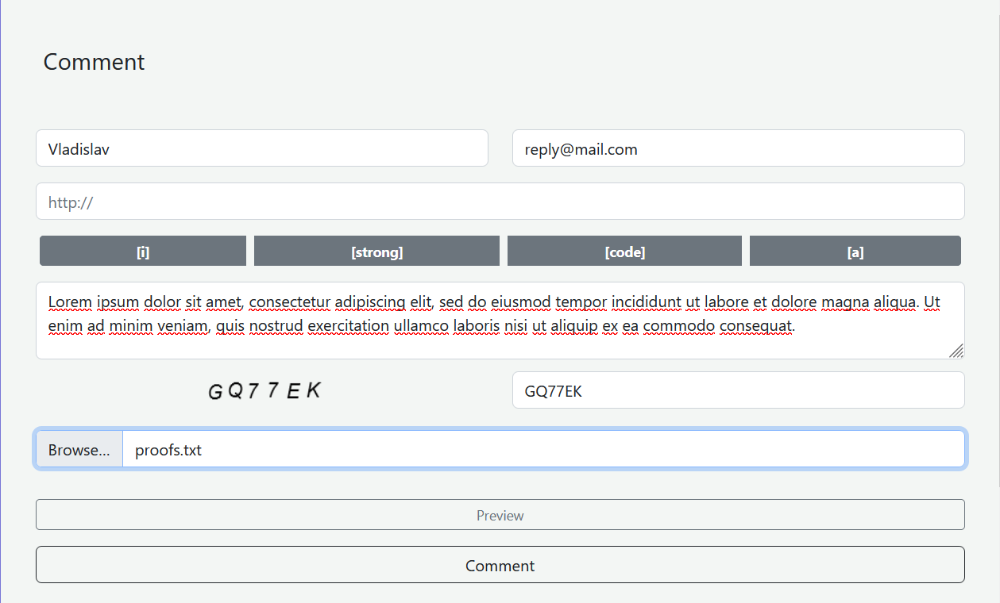

# [Comments spa](http://44.213.113.121:8888/)

An application with which you can leave comments.
As well as add a photo or a text file to the comment, each comment can be answered as many comments as you like.
Comment preview is available.
Comments are split into pages 25 comments per page, uploading from the server is dynamic

**backend: Node.js**

**frontend: React**

**db/orm: mysql/sequelize**
  

### run server

`cd server`
`npm install`
`nano .env `
(then u need to provide some variables)
  
> NODE_DOCKER_PORT=8080

> COMMENTS_ON_PAGE=25

> HOST=localhost

> USER=root

> ROOT_PASSWORD=password

> DATABASE=comments

> DB_PORT=3306

`node app`

### run client

`cd client`
`npm install`
`nano .env `
(then u need to provide server endpoint ws url)
  
> REACT_APP_WS_URL
> 
`npm start`
  
  
## Project overview

##### comment preview

##### comment reply

##### attached photo

##### sorting

##### pagination

